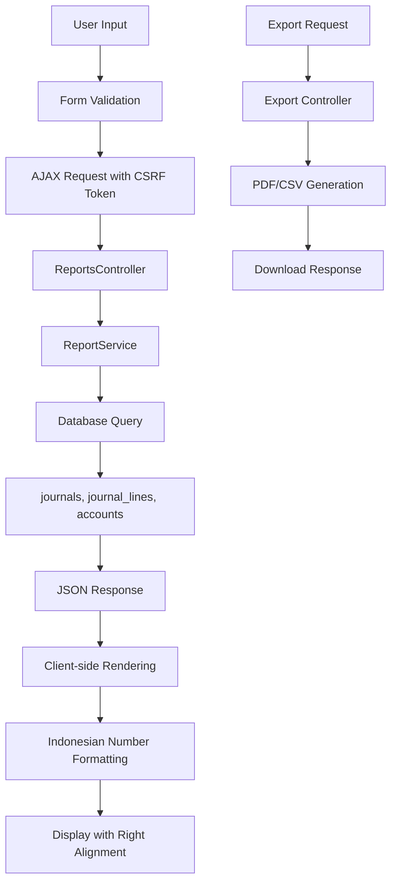
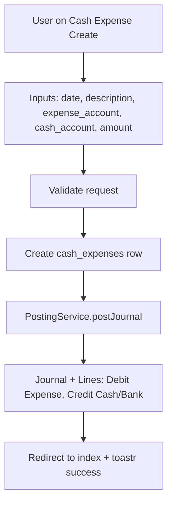
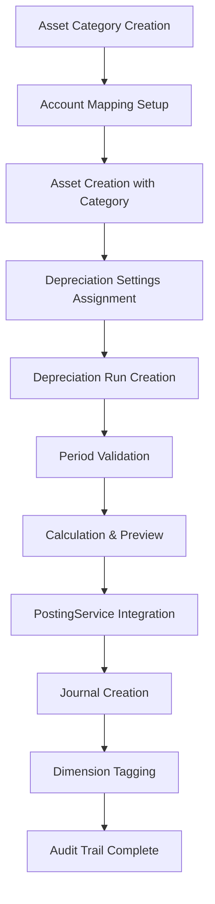
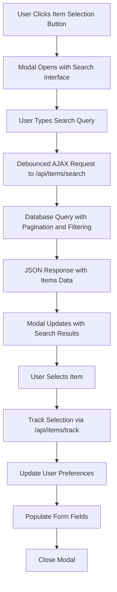
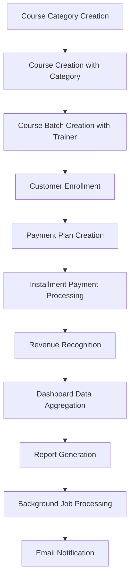
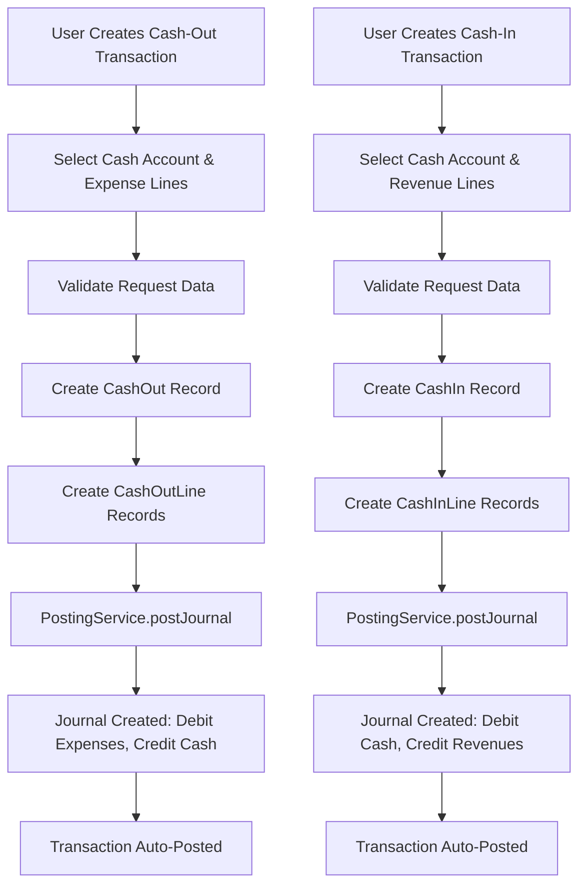

Purpose: Technical reference for understanding system design and development patterns
Last Updated: 2025-01-29 (Updated with Course Integration Testing Progress)

## Architecture Documentation Guidelines

### Document Purpose

This document describes the CURRENT WORKING STATE of the application architecture. It serves as:

-   Technical reference for understanding how the system currently works
-   Onboarding guide for new developers
-   Design pattern documentation for consistent development
-   Schema and data flow documentation reflecting actual implementation

### What TO Include

-   **Current Technology Stack**: Technologies actually in use
-   **Working Components**: Components that are implemented and functional
-   **Actual Database Schema**: Tables, fields, and relationships as they exist
-   **Implemented Data Flows**: How data actually moves through the system
-   **Working API Endpoints**: Routes that are active and functional
-   **Deployment Patterns**: How the system is actually deployed
-   **Security Measures**: Security implementations that are active

### What NOT to Include

-   **Issues or Bugs**: These belong in `MEMORY.md` with technical debt entries
-   **Limitations or Problems**: Document what IS working, not what isn't
-   **Future Plans**: Enhancement ideas belong in `backlog.md`
-   **Deprecated Features**: Remove outdated information rather than marking as deprecated
-   **Wishlist Items**: Planned features that aren't implemented yet

### Update Guidelines

-   **Reflect Reality**: Always document the actual current state, not intended state
-   **Schema Notes**: When database schema has unused fields, note them factually
-   **Cross-Reference**: Link to other docs when appropriate, but don't duplicate content

### For AI Coding Agents

-   **Investigate Before Updating**: Use codebase search to verify current implementation
-   **Move Issues to Memory**: If you discover problems, document them in `MEMORY.md`
-   **Factual Documentation**: Describe what exists, not what should exist

---

# System Architecture

## Project Overview

Prasasta ERP is a comprehensive enterprise resource planning system built with Laravel 12 and modern web technologies, designed for educational institutions and organizations requiring integrated course management, financial management, and asset tracking capabilities.

## User Interface Architecture

### Design System (Implemented)

**Framework**: AdminLTE 3 with Bootstrap 4 integration
**Theme**: Dark primary sidebar with light content areas
**Icons**: Font Awesome 5 for consistent iconography
**Components**: Select2BS4 for enhanced dropdowns

### Form Design Patterns (Implemented)

**Layout Structure**:

-   Breadcrumb navigation with Dashboard → Module → Action hierarchy
-   Page title sections with consistent header styling
-   Back buttons for improved navigation flow
-   Two-column layout for header fields with form-group row pattern

**Card-Based Design**:

-   `card-primary-outline` for main forms
-   `card-secondary-outline` for line items sections
-   `card-light-outline` for collapsible sections
-   Proper card headers with icons and action buttons

**Form Controls**:

-   Select2BS4 integration for all dropdown fields
-   `form-control-sm` classes for compact inputs
-   Required field indicators with asterisks (\*)
-   Input groups with meaningful icons
-   Real-time total calculation with Indonesian number formatting

**Table-Based Line Items**:

-   Enhanced table structure with clear column headers
-   Striped styling for better readability
-   Automatic total calculation at bottom
-   Right-aligned numeric fields
-   Dynamic add/remove functionality

### Navigation Structure (Implemented)

**Sidebar Menu Organization**:

-   **Sales Flow**: Customers → Sales Orders → Sales Invoices → Sales Receipts
-   **Purchase Flow**: Suppliers → Purchase Orders → Goods Receipts → Purchase Invoices → Purchase Payments
-   **Accounting**: Journals → Journal Approval → Cash Expenses → Accounts → Periods
-   **Banking**: Dashboard → Cash-Out → Cash-In
-   **Fixed Assets**: Asset Categories → Assets → Depreciation Runs → Asset Disposals → Asset Movements → Asset Import → Data Quality → Bulk Operations
-   **Master Data**: Projects → Funds → Departments
-   **Courses**: Course Categories → Courses → Course Batches → Enrollments → Trainers → Payment Plans → Installment Payments → Revenue Recognition
-   **Dashboards**: Executive → Financial → Operational → Performance
-   **Reports**: Comprehensive reporting section
-   **Admin**: User management and system administration

**Permission-Based Visibility**:

-   Menu items shown based on user role permissions
-   Active state management across related pages
-   Proper route pattern matching for menu highlighting

### Responsive Design (Implemented)

**Breakpoints**: Bootstrap 4 responsive grid system
**Mobile Optimization**: Touch-friendly interface elements
**Tablet Support**: Optimized layouts for medium screens
**Desktop Enhancement**: Full feature set with advanced interactions

## Technology Stack (Current)

-   **Backend**: Laravel 12, PHP 8.2, MySQL, Spatie Laravel Permission, AdminLTE 3
-   **Auth**: Custom AdminLTE login/logout (Breeze removed), Spatie roles/permissions
-   **UI**: AdminLTE layout used on Dashboard, Trial Balance, GL Detail, Manual Journal, Admin RBAC, Banking Module
-   **Services**: `App\Services\Reports\ReportService`, `App\Services\Accounting\PostingService`, `App\Services\Banking\BankingService`
    -   Additional: `App\Services\PdfService` for DomPDF rendering

## Core Components (Implemented)

-   General Ledger foundation
    -   Migrations: `accounts`, `journals`, `journal_lines`, `periods`
    -   Dimensions: `projects`, `funds`, `departments`
        -   Management UI: DataTables + modal CRUD for Projects, Funds, Departments with permission gates; deletion blocked when referenced (funds also blocked if linked to projects)
    -   Masters: `customers`, `vendors`, `tax_codes`, `bank_accounts`, `bank_transactions`
    -   Seeders: `CoASeeder`, `TaxCodeSeeder`, `FundProjectSeeder`, `RolePermissionSeeder` (admin assigned to admin@example.com)
-   RBAC: Spatie roles/permissions (`admin`, `accountant`, `approver`, `cashier`, `auditor`)
-   Reports: Trial Balance and GL Detail endpoints via `ReportsController` + `ReportService`
    -   Added AR/AP Aging and Cash Ledger with modernized UI layouts and professional export functionality
    -   All reports now use consistent AdminLTE layout structure with content headers, breadcrumbs, and card layouts
    -   Indonesian number formatting (17.000.000,00) with right-aligned columns using Intl.NumberFormat('id-ID')
    -   Professional export dropdowns with CSV/PDF options for all reports
    -   AJAX-based reports (GL Detail, Trial Balance, Cash Ledger, AR/AP Aging) with CSRF token handling
    -   Server-side reports (AR/AP Party Balances, Withholding Recap) with responsive table layouts
    -   Aging enhanced to use `due_date` (terms) when available and to report outstanding net of settlements via allocations
-   Journals: Each journal has unique `journal_no` generated as `JNL-YYYYMM-######`
-   Journal Status Workflow: Journals start in `draft` status, only approvers can post them to `posted` status
-   Journal Approval Interface: Dedicated approval page with DataTables, search filters, and SweetAlert confirmations
-   Period Close: `PeriodCloseService` to close/open months; PostingService blocks posting into closed periods
-   AR scaffolding: Sales Invoices (draft→posted) with PostingService hook creating AR/Revenue(+PPN) entries
-   AP scaffolding: Purchase Invoices (draft→posted) with PostingService hook creating Expense/Asset(+PPN Input) and AP entries
-   Cash Movements: Sales Receipts (settle AR), Purchase Payments (settle AP)
    -   Allocation tables `sales_receipt_allocations` and `purchase_payment_allocations` for per-invoice allocations (auto oldest-first)
-   Banking Module: Cash-Out and Cash-In transactions with automatic journal posting
    -   Cash-Out: Multiple debit lines (expenses/assets) + single credit line (cash/bank account)
    -   Cash-In: Single debit line (cash/bank account) + multiple credit lines (revenues/liabilities)
    -   Auto-posting: Transactions automatically create balanced journal entries without approval workflow
    -   Voucher numbering: COV-YY####### (Cash-Out), CIV-YY####### (Cash-In)
-   Upstream Docs: Sales Orders (SO), Purchase Orders (PO), Goods Receipts (GR)
    -   Minimal flow implemented to capture pre-invoice intent and receipts
    -   Status workflow: SO/PO (draft→approved→closed), GR (draft→received)
    -   Auto-numbering: All documents use consistent **numeric format** `YY + DOCUMENT_CODE + SEQUENCE` (10 digits total)
        -   **YY**: 2-digit year (e.g., 25 for 2025)
        -   **DOCUMENT_CODE**: 2-digit numeric code for document type (01-12)
        -   **SEQUENCE**: 6-digit sequential number (000001-999999, resets yearly)
        -   **Examples**:
            -   Asset Disposals: `2501000001` (Year 25 + Code 01 + Sequence 000001)
            -   Purchase Orders: `2508000001` (Year 25 + Code 08 + Sequence 000001)
            -   Sales Invoices: `2510000001` (Year 25 + Code 10 + Sequence 000001)
        -   **Document Type Codes** (alphabetical order):
            -   01: Asset Disposals, 02: Cash Expenses, 03: Cash-In Vouchers, 04: Cash-Out Vouchers
            -   05: Goods Receipts, 06: Journals, 07: Purchase Invoices, 08: Purchase Orders
            -   09: Purchase Payments, 10: Sales Invoices, 11: Sales Orders, 12: Sales Receipts
    -   "Create Invoice" actions on SO/GR/PO prefill Sales/Purchase Invoice create forms
    -   Linkage: `sales_invoices.sales_order_id`, `purchase_invoices.purchase_order_id`, `purchase_invoices.goods_receipt_id` populated on prefill and shown on invoice pages
    -   Quantity summary: PO and GR show pages display ordered vs received quantities

## Database Schema (Current Tables)

**Migration Consolidation Status**: All modify migrations have been consolidated into their respective create table migrations for cleaner database setup and reduced complexity.

-   accounts(id, code, name, type, control_type, is_control_account, description, reconciliation_frequency, tolerance_amount, is_postable, parent_id)
-   journals(id, journal_no, date, description, status [draft/posted/reversed], period_id, source_type, source_id, posted_by, posted_at, timestamps)
-   journal_lines(id, journal_id, account_id, debit, credit, project_id, fund_id, dept_id, memo)
-   periods(id, month, year, is_closed, closed_at)
-   projects(id, code, name, start_date, end_date, fund_id, budget_total, status)
-   funds(id, code, name, is_restricted)
-   departments(id, code, name)
-   tax_codes(id, code, name, type, rate)
-   customers(id, code, name, npwp, address, phone, email, student_id, emergency_contact_name, emergency_contact_phone, student_status, enrollment_count, total_paid)
-   vendors(id, code, name, npwp, address, phone, email)
-   bank_accounts(id, code, name, bank_name, account_number, currency, is_restricted)
-   bank_transactions(id, bank_account_id, date, description, amount, type, source_type, source_id)
-   sales_receipt_allocations(id, receipt_id, invoice_id, amount, timestamps)
-   purchase_payment_allocations(id, payment_id, invoice_id, amount, timestamps)
-   cash_expenses(id, voucher_number [auto-generated CEV-YYYYMM-######], date, description, account_id, amount, status, created_by, timestamps)
-   purchase_orders(id, order_no [auto-generated PO-YYYYMM-######], date, vendor_id, description, total_amount, status, timestamps)
-   purchase_order_lines(id, order_id, account_id, item_id, description, qty, unit_price, amount, vat_amount, wtax_amount, tax_code_id, timestamps)
-   sales_orders(id, order_no [auto-generated SO-YYYYMM-######], date, customer_id, description, total_amount, status, timestamps)
-   sales_order_lines(id, order_id, account_id, item_id, line_type [item/service], description, qty, unit_price, amount, vat_amount, wtax_amount, tax_code_id, timestamps)
-   goods_receipts(id, grn_no [auto-generated GR-YYYYMM-######], date, vendor_id, purchase_order_id, description, total_amount, status, timestamps)
-   goods_receipt_lines(id, grn_id, account_id, item_id, line_type [item/service], description, qty, unit_price, amount, vat_amount, wtax_amount, tax_code_id, timestamps)
-   purchase_invoices(id, invoice_no [auto-generated PINV-YYYYMM-######], date, due_date, terms_days, vendor_id, purchase_order_id, goods_receipt_id, description, total_amount, status, posted_at, timestamps)
-   purchase_invoice_lines(id, invoice_id, account_id, item_id, line_type [item/service], description, qty, unit_price, amount, vat_amount, wtax_amount, tax_code_id, project_id, fund_id, dept_id, timestamps)
-   sales_invoices(id, invoice_no [auto-generated SINV-YYYYMM-######], date, due_date, terms_days, customer_id, sales_order_id, description, total_amount, status, posted_at, timestamps)
-   sales_invoice_lines(id, invoice_id, account_id, item_id, line_type [item/service], description, qty, unit_price, amount, vat_amount, wtax_amount, tax_code_id, project_id, fund_id, dept_id, timestamps)
-   purchase_payments(id, payment_no [auto-generated PP-YYYYMM-######], date, vendor_id, description, total_amount, status, affects_inventory, posted_at, timestamps)
-   purchase_payment_lines(id, payment_id, account_id, description, amount, timestamps)
-   sales_receipts(id, receipt_no [auto-generated SR-YYYYMM-######], date, customer_id, description, total_amount, status, affects_inventory, posted_at, timestamps)
-   sales_receipt_lines(id, receipt_id, account_id, description, amount, timestamps)
-   cash_outs(id, voucher_number [auto-generated COV-YY#######], date, description, cash_account_id, total_amount, status, created_by, timestamps)
-   cash_out_lines(id, cash_out_id, account_id, amount, project_id, fund_id, dept_id, memo, timestamps)
-   cash_ins(id, voucher_number [auto-generated CIV-YY#######], date, description, cash_account_id, total_amount, status, created_by, timestamps)
-   cash_in_lines(id, cash_in_id, account_id, amount, project_id, fund_id, dept_id, memo, timestamps)
-   stock_adjustments(id, adjustment_no, date, reason, total_adjustment_value, status, created_by, approved_by, approved_at, project_id, fund_id, dept_id, timestamps)
-   items(id, code, name, description, barcode, category_id, inventory_account_id, cost_of_goods_sold_account_id, type [item/service], unit_of_measure, cost_method, min_stock_level, max_stock_level, current_stock_quantity, current_stock_value, last_cost_price, average_cost_price, is_active, timestamps)

**Foreign Key Relationships**: All foreign key constraints are properly defined in the consolidated create table migrations, including item_id relationships to items table and dimension relationships to projects, funds, and departments tables.

## Routes / Endpoints (Current)

-   Auth (AdminLTE): `GET /login`, `POST /login`, `POST /logout` (self-registration disabled per decision)
-   Routes organization:

    -   Split for maintainability under `routes/web/`:
        -   `reports.php` (reporting endpoints)
        -   `journals.php` (journals module)
        -   `orders.php` (SO/PO/GRN)
        -   `ar_ap.php` (AR/AP: invoices, receipts, payments)
    -   Included from `routes/web.php` inside the auth group to inherit middleware and guards.

-   Reports (requires `reports.view`):
    -   `GET /reports/trial-balance` (HTML) + `?date=YYYY-MM-DD` (JSON)
    -   `GET /reports/gl-detail` (HTML) + query for filters (JSON)
    -   `GET /reports/ar-aging` (HTML/JSON; supports `as_of`, `overdue=1`, `export=csv|pdf`)
    -   `GET /reports/ap-aging` (HTML/JSON; supports `as_of`, `overdue=1`, `export=csv|pdf`)
    -   `GET /reports/cash-ledger` (HTML/JSON; supports `from`, `to`, `account_id`, `export=csv|pdf`)
    -   `GET /downloads` list generated PDFs
-   Profile & Security:
    -   `GET /change-password` (HTML AdminLTE form)
    -   `PUT /password` (update password)
-   Journals:

    -   `GET /journals` list recent journals
    -   `GET /journals/manual/create` create form
    -   `POST /journals/manual` store
    -   `POST /journals/{journal}/reverse` reverse (requires `journals.reverse`)

-   Periods (requires `periods.view` / `periods.close`):
-   `GET /periods` index and year switcher
-   `POST /periods/close` close month
-   `POST /periods/open` reopen month

-   AR - Sales Invoices (requires `ar.invoices.*`):

    -   `GET /sales-invoices`, `GET /sales-invoices/create`, `POST /sales-invoices`
    -   `GET /sales-invoices/{id}`
    -   `POST /sales-invoices/{id}/post` (posts journal)

-   AP - Purchase Invoices (requires `ap.invoices.*`):
-   `GET /purchase-invoices`, `GET /purchase-invoices/create`, `POST /purchase-invoices`
-   `GET /purchase-invoices/{id}`, `POST /purchase-invoices/{id}/post`
-   `GET /purchase-invoices/{id}/print`
-   Sales Orders:
    -   `GET /sales-orders`, `GET /sales-orders/data`, `GET /sales-orders/create`, `POST /sales-orders`
    -   `GET /sales-orders/{id}`, `GET /sales-orders/{id}/create-invoice` (prefill SI)
-   Purchase Orders:
    -   `GET /purchase-orders`, `GET /purchase-orders/data`, `GET /purchase-orders/create`, `POST /purchase-orders`
    -   `GET /purchase-orders/{id}`, `GET /purchase-orders/{id}/create-invoice` (prefill PI)
-   Goods Receipts (GRN):
    -   `GET /goods-receipts`, `GET /goods-receipts/data`, `GET /goods-receipts/create`, `POST /goods-receipts`
    -   `GET /goods-receipts/{id}`, `GET /goods-receipts/{id}/create-invoice` (prefill PI)
-   Reports (Party Balances):
    -   `GET /reports/ar-balances` (HTML/JSON; supports `export=csv|pdf`)
    -   `GET /reports/ap-balances` (HTML/JSON; supports `export=csv|pdf`)
-   Sales (Masters & AR): `GET /customers` (DataTables), `GET /customers/data`, `POST /customers`, `PATCH /customers/{id}` (modal forms)
-   Purchase (Masters & AP): `GET /vendors` (DataTables), `GET /vendors/data`, `POST /vendors`, `PATCH /vendors/{id}` (modal forms)
-   Accounting: `GET /cash-expenses`, `GET /cash-expenses/data`, `GET /cash-expenses/create`, `POST /cash-expenses`, `GET /cash-expenses/{id}/print`
-   Banking (requires `banking.view`):

    -   `GET /banking/dashboard` (HTML) + `GET /banking/dashboard/data` (JSON)
    -   Cash-Out (requires `banking.cash_out`): `GET /banking/cash-out`, `GET /banking/cash-out/data`, `GET /banking/cash-out/create`, `POST /banking/cash-out`, `GET /banking/cash-out/{id}/print`
    -   Cash-In (requires `banking.cash_in`): `GET /banking/cash-in`, `GET /banking/cash-in/data`, `GET /banking/cash-in/create`, `POST /banking/cash-in`, `GET /banking/cash-in/{id}/print`

-   Dimensions (permission-gated)
    -   Projects (requires `projects.view` for list/data; `projects.manage` for create/update/delete)
        -   `GET /projects` (index HTML)
        -   `GET /projects/data` (DataTables JSON)
        -   `POST /projects` (create)
        -   `PATCH /projects/{id}` (update)
        -   `DELETE /projects/{id}` (delete; blocked if referenced by `journal_lines`)
        -   Controller: `App\Http\Controllers\Dimensions\ProjectController`
        -   View: `backend/resources/views/projects/index.blade.php`
    -   Funds (requires `funds.view`; `funds.manage` for mutations)
        -   `GET /funds`, `GET /funds/data`, `POST /funds`, `PATCH /funds/{id}`, `DELETE /funds/{id}` (delete blocked if referenced by `journal_lines` or `projects`)
        -   Controller: `App\Http\Controllers\Dimensions\FundController`
        -   View: `backend/resources/views/funds/index.blade.php`
    -   Departments (requires `departments.view`; `departments.manage` for mutations)
        -   `GET /departments`, `GET /departments/data`, `POST /departments`, `PATCH /departments/{id}`, `DELETE /departments/{id}` (delete blocked if referenced by `journal_lines`)
        -   Controller: `App\Http\Controllers\Dimensions\DepartmentController`
        -   View: `backend/resources/views/departments/index.blade.php`
-   Dimensions: `GET/POST/PATCH/DELETE /projects`, `/funds`, `/departments` with server-side DataTables `GET /{entity}/data`

## Posting Service (Current)

-   `App\Services\Accounting\PostingService`
    -   `postJournal(payload)` creates a journal and balanced lines transactionally
    -   `postDraftJournal(journalId, postedBy)` posts an existing draft journal (approver-only)
    -   `reverseJournal(journalId, date?, postedBy?)` posts a reversal journal
    -   Validations: required keys, non-negative amounts, lines present, balanced sum
    -   Status Management: Journals created as `draft`, only approvers can post to `posted` status

## UI (Current Screens)

-   Dashboard: AdminLTE boxes (Accounts, Journals, Projects, Parties), User Information card displaying name, email, username, roles (as badges), permissions count, and login timestamp
-   Reports: Trial Balance, GL Detail, AR/AP Aging, Cash Ledger, AR/AP Party Balances, Withholding Recap
    -   Modernized UI with consistent AdminLTE layout structure, content headers, and breadcrumbs
    -   Professional export dropdowns with CSV/PDF options and proper number formatting
    -   AJAX-based reports with CSRF token handling and Indonesian locale number formatting
    -   Responsive table layouts with right-aligned numeric columns
-   Journals: Manual Journal (balanced validation), Journals Index (shows `journal_no`, server-side DataTables with date/description filters and reverse action). DataTables JSON now includes `id` to build action URLs reliably.
-   Journal Approval: Dedicated approval interface (`/journals/approval`) with DataTables listing draft journals, search filters (date range, description), SweetAlert confirmation dialogs, and direct approval workflow
-   Admin: Users Index (create/edit pages), Roles Index (create/edit pages, badges for permissions), Permissions Index
-   Masters: Customers and Suppliers with DataTables and modal create/edit forms
-   Accounting: Accounts CRUD (card layout with comprehensive account management), Account Detail View with transaction history, Periods page with SweetAlert confirm, Cash Expenses (list + create + print)
    -   Cash Expense enhancements: Select2BS4 for form inputs, auto-thousand separators, enhanced index table with creator/account columns, professional print view with floating print button
    -   Manual Journal enhancements: Modern card layout with responsive design, Select2BS4 dropdowns using local AdminLTE assets, visual balance indicators with color-coded feedback, enhanced form layout with input groups and icons, thousand separators for amount displays, filtered accounts to show only postable accounts, improved table layout with proper column widths and striped rows
    -   Account Management enhancements: Comprehensive account detail view with transaction history DataTable, View action button with permission control (`accounts.view_transactions`), Account Information card displaying code, name, type, postable status, parent account, control type, control account status, and description, Account Statistics card with info boxes for Current Balance, Total Debits, Total Credits, and Transaction Count, Transaction History DataTable with server-side processing, all required columns (Posting Date, Create Date, Journal Number, Origin Document, Description, Debit, Credit, Running Balance, Created By), proper currency formatting (Rp 1.000.000,00), date formatting (dd/mm/yyyy), ordered by posting date ascending (oldest first), simplified date range filtering by posting date only with 3-column layout (From Date, To Date, Filter/Clear buttons), Export Excel button with filtered data export functionality, running balance calculation with proper debit/credit math, DataTable features including sorting, searching, pagination (25 records per page), export capabilities (Copy, CSV, Excel, PDF, Print), responsive design, Excel export with professional filename generation (`Account_1.1.1_Transactions_2025-09-23.xlsx`), raw numeric values for proper Excel calculations, UTF-8 BOM for character encoding
-   Sales: Sales Orders (list/create/show with DataTables list and prefill to Sales Invoice)
-   Purchase: Purchase Orders (list/create/show), Goods Receipts (list/create/show) with prefill to Purchase Invoice

### UI Components & Assets

-   **Select2BS4 Integration**: Local AdminLTE assets used for enhanced dropdown functionality
    -   CSS: `adminlte/plugins/select2/css/select2.min.css` and `adminlte/plugins/select2-bootstrap4-theme/select2-bootstrap4.min.css`
    -   JS: `adminlte/plugins/select2/js/select2.full.min.js`
    -   Class: `select2bs4` for Bootstrap 4 theme integration
    -   Initialization: Proper timeout handling and memory management for dynamic content
    -   **Invoice Forms**: Enhanced sales and purchase invoice create forms with Select2BS4 for all dropdowns, table-based line items, collapsible dimensions section, and improved visual hierarchy
        -   **Sales Invoice Create Form**: Breadcrumb navigation, two-column layout, input groups with icons, table-based line items
        -   **Purchase Invoice Create Form**: Matching design with consistent layout patterns, form-control-sm classes, line item deletion
-   **Form Enhancements**: Input groups with icons, responsive layouts, visual feedback indicators
-   **Data Formatting**: Thousand separators for amounts, proper number formatting, real-time validation feedback

### UI Notes

-   Admin index pages initialize DataTables using `@section('scripts')` blocks rendered by layout `@yield('scripts')`.
-   Layout `layouts/partials/scripts.blade.php` includes both `@yield('scripts')` and `@stack('scripts')` for compatibility.
-   Select2BS4 components require proper initialization timing and cleanup to prevent memory leaks in dynamic content.

## Data Flow (Reports)



## Security Implementation

-   Session auth via Laravel `web` guard; `auth` middleware on all app routes
-   Spatie Permission for RBAC, middleware aliases registered in `bootstrap/app.php`
-   Admin area gated by `permission:view-admin`; feature routes use granular permissions (e.g., `journals.view`, `journals.create`, `journals.reverse`, `reports.view`)
-   CSRF protection enabled; POST actions (e.g., reverse) use `@csrf`
-   No public registration/reset; admins manage users in Admin UI
-   Input validation on posting (dates, amounts, relationships) and server-side DataTables filtering

### Route-level permissions (current)

-   `journals.index`, `journals.data`: `journals.view`
-   `journals.manual.create`, `journals.manual.store`: `journals.create`
-   `journals.reverse`: `journals.reverse`
-   Reports endpoints: `reports.view`
-   Banking endpoints: `banking.view`, `banking.cash_out`, `banking.cash_in`
-   Dimensions endpoints:
    -   Projects: `projects.view`, `projects.manage`
    -   Funds: `funds.view`, `funds.manage`
    -   Departments: `departments.view`, `departments.manage`

## Deployment

-   PHP 8.2+, Laravel 12 app under `backend/`
-   Environment: `.env` with MySQL; queues/mail optional for Phase 1
-   Assets: AdminLTE vendor assets in `public/`; no Vite pipeline required
-   Run migrations/seeders: `php artisan migrate --seed` (CoA, Roles/Permissions, demo journals)
-   Web server: Nginx/Apache pointing to `public/index.php`; HTTPS recommended

## Quality & Tests

-   PostingService feature tests: balanced/unbalanced validation, negative/zero amount rejection, reversal creates contra lines, dimensions preserved
-   Reports feature tests: Trial Balance totals equality; GL Detail filters by account/date
-   Journal number format test: validates `JNL-YYYYMM-######` pattern

## Timezone Policy

-   Storage: UTC at database level
-   Display: Convert to `Asia/Singapore` (UTC+8) at presentation layer (Blade/helpers)

## Proposed ERD (Pending Approval)

The following ERD outlines the target bookkeeping data model for a Yayasan (non‑profit) with double‑entry accounting, fund/project dimensions, and AR/AP subledgers. This describes the intended Phase 1 schema and is pending implementation approval.

```mermaid
erDiagram
    ACCOUNTS ||--o{ JOURNAL_LINES : "account_id"
    JOURNALS ||--o{ JOURNAL_LINES : "journal_id"
    PERIODS ||--o{ JOURNALS : "period_id"
    PROJECTS ||--o{ JOURNAL_LINES : "project_id"
    FUNDS ||--o{ JOURNAL_LINES : "fund_id"
    DEPARTMENTS ||--o{ JOURNAL_LINES : "dept_id"
    TAX_CODES ||--o{ SALES_INVOICE_LINES : "tax_code_id"
    TAX_CODES ||--o{ PURCHASE_INVOICE_LINES : "tax_code_id"

    CUSTOMERS ||--o{ SALES_ORDERS : "customer_id"
    CUSTOMERS ||--o{ SALES_INVOICES : "customer_id"
    SALES_ORDERS ||--o{ SALES_ORDER_LINES : "order_id"
    SALES_INVOICES ||--o{ SALES_INVOICE_LINES : "invoice_id"

    VENDORS ||--o{ PURCHASE_ORDERS : "vendor_id"
    VENDORS ||--o{ PURCHASE_INVOICES : "vendor_id"
    PURCHASE_ORDERS ||--o{ PURCHASE_ORDER_LINES : "order_id"
    PURCHASE_INVOICES ||--o{ PURCHASE_INVOICE_LINES : "invoice_id"

    BANK_ACCOUNTS ||--o{ BANK_TRANSACTIONS : "bank_account_id"
    BANK_ACCOUNTS ||--o{ SALES_RECEIPTS : "bank_account_id"
    BANK_ACCOUNTS ||--o{ PURCHASE_PAYMENTS : "bank_account_id"
    SALES_INVOICES ||--o{ SALES_RECEIPTS : "invoice_id"
    PURCHASE_INVOICES ||--o{ PURCHASE_PAYMENTS : "invoice_id"
```



## Data Flow (Cash Expense)



## Data Flow (Cash Expense Print)

```mermaid
graph TD
    A[User clicks Print button] --> B[GET /cash-expenses/{id}/print]
    B --> C[CashExpenseController::print]
    C --> D[Load relationships: expenseAccount, creator, project, fund, department]
    D --> E[Query journal_lines for cash account]
    E --> F[Convert amount to Indonesian words]
    F --> G[Render print.blade.php with floating print button]
    G --> H[User clicks floating print button]
    H --> I[window.print() triggers browser print dialog]
```

## Data Flow (AR/AP Allocation - Auto, Oldest-First)

```mermaid
graph TD
    A[Receipt/Payment Created] --> B[Compute pool = total]
    B --> C[Query posted open invoices for party ordered by due/effective date]
    C --> D{remainingPool > 0?}
    D -- No --> E[Finish]
    D -- Yes --> F[Take next invoice]
    F --> G[remainingInv = total - allocated]
    G --> H{remainingInv > 0?}
    H -- No --> C
    H -- Yes --> I[alloc = min(remainingInv, remainingPool)]
    I --> J[Insert allocation row]
    J --> K[remainingPool -= alloc]
    K --> C
```

## Data Flow (Journals DataTables)

```mermaid
graph TD
    A[User on Journals Index] --> B[Inputs: from/to/desc filters]
    B --> C[AJAX GET /journals/data]
    C --> D[ManualJournalController::data]
    D --> E[DB query: journals + sums
        group by j.id, j.date, j.description
        apply filters]
    E --> F[DataTables JSON: id, date, desc, debit, credit, actions]
    F --> G[DataTables renders table]
    G --> H[User clicks Reverse]
    H --> I[POST /journals/{id}/reverse with CSRF]
    I --> J[ManualJournalController::reverse]
    J --> K[PostingService::reverseJournal]
    K --> L[Creates contra journal]
    L --> M[Redirect back + toastr success]
    M --> N[Table reloads via AJAX]
```

## Data Flow (Journal Approval Workflow)

```mermaid
graph TD
    A[Accountant creates Journal] --> B[ManualJournalController::store]
    B --> C[PostingService::postJournal with status='draft']
    C --> D[Journal created with status='draft', posted_by=null]
    D --> E[Approver accesses /journals/approval]
    E --> F[AJAX GET /journals/approval/data]
    F --> G[JournalApprovalController::data]
    G --> H[DB query: journals WHERE status='draft']
    H --> I[JSON response with draft journals]
    I --> J[DataTables renders approval list]
    J --> K[Approver clicks Approve button]
    K --> L[SweetAlert confirmation dialog]
    L --> M[User confirms approval]
    M --> N[POST /journals/approval/{id}/approve]
    N --> O[JournalApprovalController::approve]
    O --> P[PostingService::postDraftJournal]
    P --> Q[Journal status updated to 'posted']
    Q --> R[posted_by and posted_at set]
    R --> S[Success notification displayed]
    S --> T[Journal disappears from approval list]
```

### Core Tables (Phase 1 target)

-   Accounts: id, code, name, type (asset/liability/net_assets/income/expense), is_postable, parent_id
-   Journals: id, journal_no, date, description, status (draft/posted/reversed), period_id, source_type, source_id, posted_by, posted_at
-   JournalLines: id, journal_id, account_id, debit, credit, project_id, fund_id, dept_id, memo
-   Periods: id, month, year, is_closed, closed_at
-   Projects: id, code, name, start_date, end_date, fund_id, budget_total, status
-   Funds: id, code, name, is_restricted
-   Departments: id, code, name
-   TaxCodes: id, code, name, type (ppn_output/ppn_input/withholding), rate
-   Customers: id, code, name, npwp, address, phone, email
-   Vendors: id, code, name, npwp, address, phone, email
-   SalesOrders, SalesOrderLines
-   SalesInvoices, SalesInvoiceLines
-   SalesReceipts
-   PurchaseOrders, PurchaseOrderLines
-   PurchaseInvoices, PurchaseInvoiceLines
-   PurchasePayments
-   BankAccounts, BankTransactions

Notes:

-   Double‑entry integrity enforced by balanced `JournalLines` per `Journal`.
-   Journals reference business documents via `source_type` + `source_id`.
-   Dimensions (project, fund, department) live on `JournalLines` for granular reporting.
-   Taxes stored at line‑level via `tax_code_id` where applicable.

## Reporting

-   Withholding Recap uses per-invoice rounding (ROUND(sum per invoice, 2) then vendor totals)

## Fixed Assets Module (Implemented)

**Status**: Phase 1-5 Complete - Foundation, User Interface, Advanced Features, Reporting, and Data Management operational

### Current Implementation (Phase 1-5 Complete)

**Database Schema (Implemented)**

-   `asset_categories`: id, code, name, description, life_months_default, method_default, salvage_value_policy, non_depreciable, account mappings (asset, accumulated_depreciation, depreciation_expense, gain_on_disposal, loss_on_disposal), is_active
-   `assets`: id, code, name, description, serial_number, category_id, acquisition_cost, salvage_value, current_book_value, accumulated_depreciation, method, life_months, placed_in_service_date, status (active/retired/disposed), disposal_date, dimensions (fund_id, project_id, department_id), source links (vendor_id, purchase_invoice_id)
-   `asset_depreciation_entries`: id, asset_id, period (YYYY-MM), amount, book (financial/tax), journal_id, dimension snapshot (fund_id, project_id, department_id)
-   `asset_depreciation_runs`: id, period, status (draft/posted/reversed), total_depreciation, asset_count, journal_id, created_by, posted_by, posted_at, notes
-   `asset_disposals`: id, asset_id, disposal_date, disposal_type, disposal_proceeds, book_value_at_disposal, gain_loss_amount, gain_loss_type, disposal_reason, disposal_method, disposal_reference [auto-generated DIS-YYYYMM-######], journal_id, created_by, posted_by, posted_at, status, notes
-   `asset_movements`: id, asset_id, movement_date, movement_type, from_location, to_location, from_custodian, to_custodian, movement_reason, notes, reference_number, created_by, approved_by, approved_at, status

**Models & Relationships (Implemented)**

-   `AssetCategory`: BelongsTo Account (5 account types), HasMany Asset, scopes (active, depreciable), helper methods (defaultDepreciationRate, canBeDeleted)
-   `Asset`: BelongsTo AssetCategory/Fund/Project/Department/Vendor/PurchaseInvoice, HasMany AssetDepreciationEntry/AssetDisposal/AssetMovement, scopes (active, depreciable), helper methods (depreciationRate, depreciableCost, remainingLifeMonths, calculateMonthlyDepreciation, getTotalDepreciationToDate, isDepreciated, canBeDeleted, canBeDisposed, isDisposed)
-   `AssetDepreciationEntry`: BelongsTo Asset/Journal/Fund/Project/Department, scopes (financial, tax, posted, draft, forPeriod), helper methods (isPosted, periodYear, periodMonth, periodDisplay)
-   `AssetDepreciationRun`: BelongsTo Journal/User (creator, poster), HasMany AssetDepreciationEntry, scopes (draft, posted, reversed, forPeriod), helper methods (isDraft, isPosted, isReversed, canBePosted, canBeReversed, periodYear, periodMonth, periodDisplay, statusBadge)
-   `AssetDisposal`: BelongsTo Asset/Journal/User (creator, poster), scopes (draft, posted, reversed, forDateRange, byType), helper methods (isDraft, canBePosted, getStatusBadgeAttribute, calculateGainLoss)
-   `AssetMovement`: BelongsTo Asset/User (creator, approver), scopes (draft, approved, completed, cancelled, forDateRange, byType, byAsset), helper methods (isDraft, canBeApproved, getStatusBadgeAttribute, getMovementTypeDisplayAttribute, getMovementSummaryAttribute, approve, complete, cancel)

**Service Layer (Implemented)**

-   `FixedAssetService`: Core business logic with PostingService and PeriodCloseService integration, depreciation runs, calculation, posting, reversal, disposal posting/reversal, movement workflow management
-   `AssetReportService`: Comprehensive reporting service with 8 report types, filtering capabilities, CSV/Excel export functionality, asset summary statistics, aging analysis, data quality tools

**User Interface (Implemented)**

-   Asset Categories: DataTables index with modal CRUD, account mapping with Select2BS4, validation, deletion guards
-   Assets: DataTables index with filters (category, status, fund, project, department), separate create page, modal edit, comprehensive form validation, dimension and vendor integration
-   Depreciation Runs: DataTables index with period selection modal, create/store workflow, posting/reversal actions
-   Asset Disposals: DataTables index with filters, CRUD operations, workflow management (draft/posted/reversed), gain/loss calculation display
-   Asset Movements: DataTables index with filters, CRUD operations, approval workflow (draft/approved/completed/cancelled), movement tracking
-   Asset Reports: Comprehensive reporting interface with 8 report types, advanced filtering, export options (CSV/Excel), professional formatting
-   Dashboard Integration: Asset summary widgets with key metrics, quick action buttons, executive visibility
-   Asset Import: CSV bulk import interface with validation, templates, error handling, and reference data
-   Data Quality Tools: Comprehensive data quality dashboard with duplicate detection, completeness reports, consistency checks, and orphaned record identification
-   Bulk Operations: Mass update interface for asset attributes with preview functionality and safety controls
-   Vendor Management: Enhanced vendor profiles with asset acquisition history, purchase orders, and performance tracking
-   PO Integration: Direct asset creation from purchase orders with streamlined workflow

**Routes & Controllers (Implemented)**

-   Asset Categories: `/asset-categories` (index, data, store, update, destroy, get-accounts)
-   Assets: `/assets` (index, data, show, create, edit, store, update, destroy, get-categories, get-funds, get-projects, get-departments, get-vendors, bulk-operations)
-   Depreciation: `/assets/depreciation` (index, data, create, store, show, calculate, create-entries, post, reverse, entries), `/assets/{asset}/schedule`

**Route Architecture Notes**

-   Depreciation routes are nested within the assets route group to avoid conflicts with `/{asset}` catch-all route
-   Route hierarchy: `/assets/depreciation/*` must be defined before `/assets/{asset}` to prevent route conflicts
-   All asset-related routes properly protected by Spatie permissions middleware
-   Asset Disposals: `/assets/disposals` (index, data, create, store, show, edit, update, destroy, post, reverse)
-   Asset Movements: `/assets/movements` (index, data, create, store, show, edit, update, destroy, approve, complete, cancel, asset-history)
-   Asset Reports: `/reports/assets` (index, register, depreciation-schedule, disposal-summary, movement-log, summary, aging, low-value, depreciation-history, data)
-   Asset Import: `/assets/import` (index, template, validate, import, reference-data, bulk-update)
-   Data Quality: `/assets/data-quality` (index, duplicates, incomplete, consistency, orphaned, export, score, duplicate-details, assets-by-issue)
-   Bulk Operations: `/assets/bulk-operations` (index, data, preview, update)
-   Vendor Management: `/vendors` (index, data, create, store, show, edit, update, assets, purchase-orders, asset-acquisition-history)
-   PO Integration: `/purchase-orders/{id}/create-assets`, `/purchase-orders/{id}/store-assets`, `/purchase-orders/asset-categories`

**Permissions (Implemented)**

-   Asset Management: `assets.view/create/update/delete`
-   Category Management: `asset_categories.view/manage`
-   Depreciation Operations: `assets.depreciation.run/reverse`
-   Disposal Management: `assets.disposal.view/create/update/delete/post/reverse`
-   Movement Management: `assets.movement.view/create/update/delete/approve`
-   Reporting Access: `assets.reports.view`
-   Import Operations: `assets.create` (for import), `assets.update` (for bulk updates)
-   Data Quality Access: `assets.view` (for data quality tools)
-   Vendor Management: `vendors.view/create/update/delete` (enhanced with asset integration)

**Role-Based Permissions (Enhanced)**

-   **Approver Role**: Enhanced with `assets.view` permission for depreciation runs access
-   **Cashier Role**: Comprehensive permissions including `ar.receipts.view/create`, `ap.payments.view/create`, `customers.view`
-   **Auditor Role**: Read-only access to all modules (`journals.view`, `ar.invoices.view`, `ap.invoices.view`, `assets.view`, `customers.view`, `vendors.view`, all master data permissions)
-   **Accountant Role**: Full creation permissions with draft workflow (journals, invoices, receipts)
-   **Super Admin**: Complete system access with all permissions

**Navigation (Implemented)**

-   Master Data sidebar includes Fixed Assets section with Asset Categories, Assets, Depreciation Runs, Asset Disposals, Asset Movements, Asset Import, Data Quality, and Bulk Operations menu items
-   Reports sidebar includes Asset Reports section with comprehensive reporting options
-   Dashboard includes Asset Summary widgets with key metrics and quick actions
-   Vendor management enhanced with asset integration and detailed profiles
-   Purchase Orders enhanced with direct asset creation capability
-   All routes protected by appropriate Spatie permissions

### Integration Points (Current)

**PostingService Integration**

-   FixedAssetService injected with PostingService for journal creation
-   Depreciation entries link to journals via journal_id

**Period Close Integration**

-   FixedAssetService injected with PeriodCloseService for period validation
-   Depreciation runs respect closed periods

**Dimension Integration**

-   Assets support fund/project/department dimension defaults
-   Depreciation entries snapshot dimensions at posting time
-   All postings tagged with fund/project/department

**Account Integration**

-   Asset categories mapped to existing CoA accounts (Fixed Assets, Accumulated Depreciation, Depreciation Expense, Gain/Loss on Disposal)
-   Seeder creates 6 standard categories with proper account mappings

### Data Flow (Current Implementation)



### Completed Implementation (Phases 3-5)

**Phase 3: Advanced Features** ✅ COMPLETE

-   ✅ Disposal management with gain/loss calculation and GL posting
-   ✅ Movement tracking for locations and custodians with audit trail
-   ⏳ Advanced depreciation methods (Declining Balance/DDB/WDV) - Pending
-   ⏳ Policy management and method selection flexibility - Pending

**Phase 4: Reporting & Analytics** ✅ COMPLETE

-   ✅ Standard reports: Asset Register, Depreciation Schedule, Disposal Summary, Movement Log
-   ✅ Export capabilities: CSV, Excel with customizable date ranges and professional formatting
-   ✅ Dashboard integration with asset summaries and key metrics
-   ✅ Additional reports: Asset Summary, Asset Aging, Low Value Assets, Depreciation History

**Phase 5: Data Management & Integration** ✅ COMPLETE

-   ✅ CSV bulk import with validation, templates, and error handling
-   ✅ PO integration with direct asset creation from purchase orders
-   ✅ Vendor management integration with asset acquisition history and detailed profiles
-   ✅ Data quality tools with duplicate detection, completeness reports, and consistency checks
-   ✅ Bulk update capabilities for dimensions and locations with preview functionality

**Total Implementation**: Complete - All 5 phases implemented and operational

## Modal-Based Item Selection System (Implemented)

**Status**: Complete - Performance-Optimized Item Selection with User Preferences operational

### Current Implementation (Complete)

**Performance Problem Solved**: Replaced inefficient dropdown loading of thousands of inventory items with modal-based selection system using AJAX, pagination, and filtering for optimal performance and user experience.

**Database Schema (Implemented)**

-   `user_item_preferences`: id, user_id, item_id, usage_count, last_used_at, timestamps
    -   Tracks user item usage patterns for personalized recommendations
    -   Unique constraint on user_id + item_id to prevent duplicates
    -   Indexes for performance on user_id + last_used_at and user_id + usage_count

**API Endpoints (Implemented)**

-   `GET /api/items/search` - Paginated item search with filtering (query, category_id, type, page, per_page)
-   `GET /api/items/{id}` - Single item details retrieval
-   `GET /api/items/recent` - Recent items for quick access (limit parameter)
-   `GET /api/items/favorites` - Favorite items based on usage count (limit parameter)
-   `GET /api/items/categories` - Available categories for filtering
-   `POST /api/items/track` - Track item selection for user preferences

**Service Layer (Implemented)**

-   `ItemController` (API): Handles all item-related API endpoints with proper validation and error handling
-   `UserItemPreferencesService`: Manages user item preferences, tracks usage, calculates recent and favorite items
-   Database indexing: Added performance indexes to items table (is_active+type, is_active+category_id, code, name, barcode, updated_at)

**User Interface (Implemented)**

-   `item-selection-modal.blade.php`: Reusable modal component with search, pagination, filtering, recent items, and favorites
-   `ItemSelector` JavaScript class: Handles modal functionality, AJAX requests, debounced search, pagination, and item selection
-   Integration across all Purchase and Sales workflow forms:
    -   Purchase Orders, Purchase Invoices, Goods Receipts
    -   Sales Orders, Sales Invoices
    -   Replaced old select2 dropdowns with modal-based selection

**Technical Features (Implemented)**

-   **Performance Optimization**: AJAX-based loading with pagination (20 items per page)
-   **Search Functionality**: Real-time search with 300ms debounce on code, name, and barcode
-   **Filtering**: Category and type (item/service) filtering capabilities
-   **User Preferences**: Recent items (last 6 used) and favorite items (most used) tracking
-   **Responsive Design**: Mobile-friendly modal with proper Bootstrap integration
-   **Error Handling**: Comprehensive error handling with user-friendly messages
-   **Caching**: Recent and favorite items cached for improved performance

**Integration Points (Current)**

-   **Form Integration**: All workflow forms now use modal-based item selection
-   **User Experience**: Consistent item selection experience across all modules
-   **Performance**: Eliminated loading thousands of items into dropdowns
-   **Scalability**: Handles large inventory databases efficiently
-   **Personalization**: User-specific recent and favorite items for improved productivity

### Data Flow (Current Implementation)



### Performance Benefits Achieved

-   **Load Time**: Reduced from loading 1000+ items to 20 items per page
-   **Memory Usage**: Eliminated large JavaScript arrays in browser memory
-   **User Experience**: Fast search, filtering, and personalized recommendations
-   **Scalability**: System handles inventory growth without performance degradation
-   **Network Efficiency**: Only loads data when needed with proper pagination

## System Testing & Validation

### Comprehensive ERP Testing Completed ✅

The ERP system has undergone comprehensive testing using interactive scenarios and reporting validation to ensure production readiness with Indonesian business compliance.

### Interactive Scenario Testing

**Scenario 1: Donation Recording** ✅ COMPLETE

-   Created Rp 50,000,000 donation journal entry
-   Demonstrated proper SAK compliance and Indonesian accounting standards
-   Validated balanced journal entry creation with project assignment

**Scenario 2: Office Supply Purchase** ✅ COMPLETE

-   Recorded Rp 2,500,000 office supplies transaction
-   Tested balanced debits/credits with proper account classification
-   Validated Indonesian supplier naming conventions

**Scenario 3: Customer Invoice** ✅ COMPLETE

-   Generated invoice for PT Mandiri Sejahtera (Rp 15,000,000 including 11% PPN)
-   Created customer master data with Indonesian contact details
-   Tested project assignment and tax calculation functionality

**Scenario 4: Complex Asset Purchase** ✅ COMPLETE

-   Created supplier PT Komputer Maju with complete contact information
-   Generated purchase invoice for 10 computers (Rp 67,567,570)
-   Validated asset account classification and multi-line invoice processing

### Reporting System Validation

**Trial Balance Report** ✅ COMPLETE

-   Successfully loaded and displayed financial data
-   Demonstrated proper date filtering and data aggregation
-   Confirmed system shows 0 totals for draft entries (expected behavior)

**GL Detail Report** ✅ COMPLETE

-   Validated date range filtering functionality
-   Confirmed proper column structure (Date, Journal, Account, Debit, Credit, Memo)
-   Tested report generation with comprehensive transaction details

**Asset Reports** ✅ COMPLETE

-   Accessed asset reporting functionality
-   Validated proper permission controls and access management
-   Confirmed integration with fixed asset management system

### Indonesian Business Compliance Validation

**Currency & Tax Compliance** ✅ COMPLETE

-   Indonesian Rupiah currency formatting throughout system
-   PPN (VAT) tax handling at 11% with proper input/output classification
-   Indonesian company naming conventions (PT, Yayasan, CV)

**Accounting Standards** ✅ COMPLETE

-   SAK (Indonesian Accounting Standards) compliance context
-   Proper chart of accounts structure for Indonesian entities
-   Multi-dimensional tracking (Projects, Funds, Departments) for cost analysis

### System Integration Testing

**Master Data Management** ✅ COMPLETE

-   Customer creation and management workflows
-   Supplier creation and contact information handling
-   Account classification and tax code configuration

**Transaction Processing** ✅ COMPLETE

-   Journal entry creation with balanced debits/credits
-   Sales invoice generation with customer and project assignment
-   Purchase invoice processing with supplier and asset classification

**Document Workflow** ✅ COMPLETE

-   DRAFT → Posted workflow validation
-   Professional invoice layouts and formatting
-   Real-time calculation of totals and tax amounts

### Production Readiness Assessment

**Enterprise-Grade Functionality** ✅ VALIDATED

-   Robust transaction processing across all major business processes
-   Comprehensive audit trails through GL Detail and Trial Balance reports
-   Multi-dimensional tracking capabilities for sophisticated cost analysis

**Indonesian Localization** ✅ VALIDATED

-   Complete Indonesian business environment compliance
-   Proper tax regulations implementation (PPN, PPh)
-   Indonesian currency and company structure support

**System Reliability** ✅ VALIDATED

-   Seamless navigation between modules
-   Consistent data entry across different transaction types
-   Professional user interface with modern components

**Total Testing Status**: Complete - System validated for production deployment with comprehensive Indonesian business compliance

## Course Management System (Implemented)

**Status**: Phase 1-3 Complete + Comprehensive Testing + Revenue Recognition + Export Functionality - Full Accounting Integration with Financial Reporting, Cost Management, Event-Driven Architecture, Revenue Recognition System, CSV Export, and Complete Test Suite operational

### Current Implementation (Phase 1-3 Complete)

**Database Schema (Implemented)**

-   `course_categories`: id, name, description, is_active, created_at, updated_at
-   `courses`: id, category_id, name, description, duration_hours, base_price, capacity, status, created_at, updated_at
-   `course_batches`: id, course_id, batch_code, start_date, end_date, schedule, location, trainer_id, capacity, status, revenue_recognized, revenue_recognized_at, revenue_recognition_journal_id, created_at, updated_at
-   `enrollments`: id, student_id, batch_id, enrollment_date, status, payment_plan_id, total_amount, journal_entry_id, is_accounted_for, accounted_at, created_at, updated_at
-   `customers`: id, name, email, phone, address, company, created_at, updated_at
-   `trainers`: id, name, email, phone, specialization, hourly_rate, is_active, created_at, updated_at
-   `payment_plans`: id, code, name, description, installment_count, installment_interval_days, down_payment_percentage, late_fee_percentage, grace_period_days, is_active, created_at, updated_at
-   `installment_payments`: id, enrollment_id, installment_number, amount, due_date, paid_date, paid_amount, late_fee, status, payment_method, reference_number, journal_entry_id, is_accounted_for, accounted_at, created_at, updated_at
-   `revenue_recognitions`: id, enrollment_id, batch_id, recognition_date, amount, type, description, journal_entry_id, is_posted, created_at, updated_at

**Models & Relationships (Implemented)**

-   `CourseCategory`: HasMany Course, scopes (active), helper methods (canBeDeleted)
-   `Course`: BelongsTo CourseCategory, HasMany CourseBatch, scopes (active), helper methods (canBeDeleted, getActiveBatchesCount)
-   `CourseBatch`: BelongsTo Course/Trainer, HasMany Enrollment, BelongsTo Journal (revenue recognition), scopes (active, upcoming, ongoing, completed), helper methods (canBeDeleted, getEnrollmentCount, getUtilizationPercentage, isFull, getStatusBadgeAttribute, isRevenueRecognized)
-   `Enrollment`: BelongsTo Customer/Student, CourseBatch, PaymentPlan, Journal, HasMany InstallmentPayment, RevenueRecognition, helper methods (isAccountedFor)
-   `InstallmentPayment`: BelongsTo Enrollment, Journal, helper methods (isAccountedFor, isOverdue, isPaid)
-   `RevenueRecognition`: BelongsTo Enrollment, CourseBatch, helper methods (isDeferred, isRecognized, isPosted)

**Accounting Integration (Phase 1-3 Complete)**

-   **CourseAccountingService**: Complete financial integration with automatic journal entry generation
-   **Event-Driven Architecture**: Automatic accounting triggers via Laravel events
-   **Multi-dimensional Tracking**: Category-specific revenue and deferred revenue accounts
-   **Revenue Recognition**: Proper deferred revenue management with batch-level recognition
-   **Cost Management**: Trainer costs and course delivery expense tracking
-   **Financial Reporting**: Comprehensive profitability and receivables analysis

**Event Listeners (Implemented)**

-   `ProcessEnrollmentAccounting`: Creates AR and Deferred Revenue entries on enrollment
-   `ProcessPaymentAccounting`: Records cash receipts and AR settlements
-   `ProcessRevenueRecognition`: Recognizes deferred revenue when batches start
-   `ProcessCancellationAccounting`: Properly reverses accounting entries for cancellations

**Financial Reports (Implemented)**

-   **Course Profitability Report**: Revenue analysis, utilization rates, cost breakdown
-   **Outstanding Receivables Report**: Payment tracking with overdue analysis
-   **Revenue Recognition Report**: Deferred vs recognized revenue tracking
-   **Payment Collection Report**: Collection performance and aging analysis

**Account Structure (Enhanced)**

-   **Category-Specific Accounts**: Deferred Revenue and Revenue accounts by course category
-   **Course-Specific Tracking**: Digital Marketing, Data Analytics, Project Management
-   **PPN Compliance**: Proper 11% tax handling for Indonesian regulations
-   **Cost Accounts**: Trainer costs and course delivery expenses

**Controllers & Services (Implemented)**

-   `CourseController`: CRUD operations with permission-based access
-   `CourseBatchController`: Batch management with capacity tracking
-   `EnrollmentController`: Student enrollment with automatic accounting triggers
-   `InstallmentPaymentController`: Payment processing with accounting integration
-   `CourseFinancialReportController`: Comprehensive financial reporting with CSV export functionality
    -   `getCourseProfitabilityData()`: Enhanced with revenue recognition tracking (latest_recognition_date, enrollments_with_recognition, active_batches)
    -   `exportCourseProfitability()`: CSV export with filtered data, professional filename generation, UTF-8 encoding
    -   Recognition status indicators: Fully Recognized, Partially Recognized, Not Recognized
    -   Recognition date tracking and deferred revenue calculations
-   `CourseAccountingService`: Core accounting integration service
-   `CourseCostManagementService`: Cost tracking and profitability analysis
-   `PaymentProcessingService`: Installment generation and processing

**Routes (Implemented)**

-   Course management routes with proper middleware
-   Financial report routes with permission-based access
-   CSV export routes with filtered data support
-   DataTables integration for all listing views

**Permissions (Implemented)**

-   `course_financial_reports.view`: Access to financial reports
-   `course_financial_reports.profitability`: Course profitability analysis
-   `course_financial_reports.receivables`: Outstanding receivables management
-   `course_financial_reports.revenue_recognition`: Revenue recognition reports
-   `course_financial_reports.payment_collection`: Payment collection analysis

**Testing Status (Comprehensive Test Suite Complete - All Tests Passing)**

-   **Unit Tests**: 13 comprehensive test methods for CourseAccountingService covering all functionality (ALL PASSING - 105 assertions)
-   **Feature Tests**: 20+ test methods for Course Financial Reports with permission validation and export testing
-   **Integration Tests**: Complete end-to-end workflow testing from enrollment to revenue recognition
-   **Test Scenarios Documentation**: 9 detailed test scenarios covering all business workflows
-   **Performance Testing**: Scalability testing with multiple concurrent transactions
-   **Security Testing**: Permission-based access control validation
-   **Error Handling Testing**: Edge cases and exception scenarios covered
-   **Business Logic Validation**: Accounting principles compliance verified
-   **Event-Driven Architecture Testing**: All events and listeners validated
-   **Data Integrity Testing**: Journal entry balancing and account verification
-   **Quick Reference Guide**: Comprehensive test execution guide with troubleshooting
-   **Critical Fixes Applied**: Database schema alignment (account_id vs account_code), payment field corrections, PPN calculation fixes, cancellation logic enhancements, test data setup improvements

**Test Files (Implemented)**

-   `tests/Unit/CourseAccountingServiceTest.php`: Unit tests for core accounting service functionality
-   `tests/Feature/CourseFinancialReportTest.php`: Feature tests for financial reporting endpoints
-   `tests/Feature/CourseAccountingIntegrationTest.php`: Integration tests for complete workflows
-   `docs/test-scenarios/COURSE_INTEGRATION_TEST_SCENARIOS.md`: Comprehensive test scenarios documentation
-   `docs/test-scenarios/COURSE_TEST_QUICK_REFERENCE.md`: Quick reference guide for test execution

**Background Jobs (Implemented)**

-   `GeneratePDFReportJob`: Asynchronous PDF report generation with email notification
-   `GenerateExcelReportJob`: Asynchronous Excel report generation with email notification
-   `GenerateCSVReportJob`: Asynchronous CSV report generation with email notification
-   `App\Mail\ReportGenerated`: Email notification service for completed report generation

**User Interface (Implemented)**

-   Course Categories: DataTables index with modal CRUD, validation, deletion guards
-   Courses: DataTables index with filters (category, status), separate create page, modal edit, comprehensive form validation
-   Course Batches: DataTables index with filters (course, trainer, status), CRUD operations, enrollment management
-   Dashboard Views: 4 comprehensive dashboard templates (Executive, Financial, Operational, Performance) with AdminLTE integration
-   Report Generation: Asynchronous report generation with email notifications and download links

**Routes & Controllers (Implemented)**

-   Course Categories: `/course-categories` (index, data, store, update, destroy)
-   Courses: `/courses` (index, data, create, store, show, edit, update, destroy)
-   Course Batches: `/course-batches` (index, data, create, store, show, edit, update, destroy)
-   Dashboards: `/dashboard/executive`, `/dashboard/financial`, `/dashboard/operational`, `/dashboard/performance`
-   Reports: `/reports/payment-aging`, `/reports/payment-collection`, `/reports/overdue-payments`, `/reports/revenue-recognition`, `/reports/deferred-revenue`, `/reports/course-performance`, `/reports/enrollment`, `/reports/capacity-utilization`, `/reports/trainer-performance`, `/reports/trainer-utilization`, `/reports/trainer-revenue`

**Permissions (Implemented)**

-   Course Management: `course_categories.view/manage`, `courses.view/create/update/delete`, `course_batches.view/create/update/delete`
-   Dashboard Access: `dashboard.executive.view`, `dashboard.financial.view`, `dashboard.operational.view`, `dashboard.performance.view`
-   Reporting Access: `reports.payment.view`, `reports.course.view`, `reports.trainer.view`

**Navigation (Implemented)**

-   Master Data sidebar includes Course Management section with Course Categories, Courses, and Course Batches menu items
-   Dashboard sidebar includes Executive, Financial, Operational, and Performance dashboard options
-   Reports sidebar includes comprehensive reporting options for payment, course, and trainer analytics
-   All routes protected by appropriate Spatie permissions

### Integration Points (Current)

**Dashboard Integration**

-   DashboardDataService provides comprehensive analytics for all dashboard types
-   Real-time data aggregation with proper relationship loading
-   Professional AdminLTE integration with responsive design

**Export Services Integration**

-   Asynchronous report generation with background job processing
-   Email notifications for completed reports
-   Multiple export formats (PDF, Excel, CSV) with professional formatting

**Revenue Recognition System (Implemented)**

-   `RecognizeRevenueJob`: Automatic revenue recognition job dispatched when course batch starts
-   `BatchStarted` Event: Triggered when course batch status changes to 'ongoing'
-   `BatchStartedListener`: Handles BatchStarted event and dispatches RecognizeRevenueJob
-   Manual Batch Start Controls: Course batch controller with start method and validation
-   Revenue Recognition Tracking: revenue_recognitions table with enrollment_id, batch_id, recognition_date, amount, type, journal_entry_id, is_posted

**Export Functionality (Implemented)**

-   CSV Export System: CourseProfitabilityExport class with comprehensive data processing
-   Professional Filename Generation: Course_Profitability_Report_YYYY-MM-DD_HH-MM-SS.csv format
-   UTF-8 Encoding: Proper character encoding with BOM for international characters
-   Filtered Export: Respects current date range and category filters
-   Error Handling: Comprehensive error handling with user-friendly messages
-   Network Monitoring: Chrome DevTools integration for export validation

-   Queue-based report generation for improved performance
-   Email notification system for completed reports
-   Proper error handling and job status tracking

### Data Flow (Current Implementation)



### Completed Implementation (Phases 4-5)

**Phase 4: Automation & Reporting** ✅ COMPLETE

-   ✅ Database schema implementation with 3 new migrations
-   ✅ Eloquent models with comprehensive relationships
-   ✅ CRUD controllers with DataTables integration
-   ✅ Export services architecture (PDF, Excel, CSV)
-   ✅ Asynchronous report generation with background jobs
-   ✅ Dashboard data service with comprehensive analytics
-   ✅ Dashboard view templates with AdminLTE integration

**Phase 5: PDF/Excel Export Services** ✅ COMPLETE

-   ✅ Background job implementation for report generation
-   ✅ Email notification system for completed reports
-   ✅ Professional export formatting with multiple formats
-   ✅ Comprehensive dashboard testing and validation
-   ✅ All dashboard sub-menu items verified working

**Total Implementation**: Complete - All phases implemented and operational

## Banking Module (Implemented)

**Status**: Complete - Database Schema, Models, Controllers, Views, Routes, and Permissions operational

### Current Implementation (Complete)

**Database Schema (Implemented)**

-   `cash_outs`: id, voucher_number [auto-generated COV-YY#######], date, description, cash_account_id, total_amount, status, created_by, timestamps
-   `cash_out_lines`: id, cash_out_id, account_id, amount, project_id, fund_id, dept_id, memo, timestamps
-   `cash_ins`: id, voucher_number [auto-generated CIV-YY#######], date, description, cash_account_id, total_amount, status, created_by, timestamps
-   `cash_in_lines`: id, cash_in_id, account_id, amount, project_id, fund_id, dept_id, memo, timestamps

**Models & Relationships (Implemented)**

-   `CashOut`: BelongsTo Account (cash account), User (creator), HasMany CashOutLine
-   `CashOutLine`: BelongsTo CashOut, Account (expense/asset), Project, Fund, Department
-   `CashIn`: BelongsTo Account (cash account), User (creator), HasMany CashInLine
-   `CashInLine`: BelongsTo CashIn, Account (revenue/liability), Project, Fund, Department

**Service Layer (Implemented)**

-   `PostingService` integration for automatic journal entry creation
-   Cash-Out: Multiple debit lines (expenses/assets) + single credit line (cash/bank account)
-   Cash-In: Single debit line (cash/bank account) + multiple credit lines (revenues/liabilities)
-   Auto-posting: Transactions automatically create balanced journal entries without approval workflow

**User Interface (Implemented)**

-   Banking Dashboard: Summary cards (Daily Cash In/Out, Net Flow, Monthly Net Flow), account balances, recent transactions, top expenses/revenues
-   Cash-Out: DataTables index, create form with line items, print functionality
-   Cash-In: DataTables index, create form with line items, print functionality
-   AdminLTE integration with consistent styling and responsive design

**Routes & Controllers (Implemented)**

-   Banking Dashboard: `/banking/dashboard` (index, data)
-   Cash-Out: `/banking/cash-out` (index, data, create, store, print)
-   Cash-In: `/banking/cash-in` (index, data, create, store, print)
-   Controllers: `BankingDashboardController`, `CashOutController`, `CashInController`

**Permissions (Implemented)**

-   Banking Access: `banking.view` (dashboard access)
-   Cash-Out Management: `banking.cash_out` (create, view, print)
-   Cash-In Management: `banking.cash_in` (create, view, print)
-   Role assignments: Superadmin, Accountant, Approver, Cashier (full access), Auditor (read-only)

**Navigation (Implemented)**

-   Banking menu group in sidebar with university icon (🏛️)
-   Submenu items: Dashboard, Cash-Out, Cash-In
-   Permission-based visibility and active state management
-   Proper route pattern matching for menu highlighting

### Integration Points (Current)

**PostingService Integration**

-   Automatic journal entry creation for all banking transactions
-   Balanced double-entry accounting with proper debit/credit allocation
-   Source tracking via `source_type` and `source_id` fields

**Account Integration**

-   Full integration with Chart of Accounts
-   Support for any postable debit/credit accounts (not limited to expenses/revenues)
-   Proper account validation and selection

**Dimension Integration**

-   Project, Fund, Department dimension support on line items
-   Proper dimension tracking for reporting and analysis
-   Optional dimension assignment per line item

### Data Flow (Current Implementation)



### Voucher Numbering System

**Cash-Out Vouchers**: `COV-YY#######` format

-   Example: `COV-250000001` (COV + 2-digit year + 7-digit sequence)
-   Sequential numbering per year
-   Unique constraint enforced at database level

**Cash-In Vouchers**: `CIV-YY#######` format

-   Example: `CIV-250000001` (CIV + 2-digit year + 7-digit sequence)
-   Sequential numbering per year
-   Unique constraint enforced at database level

### Testing & Validation (Complete)

**Comprehensive Testing Completed** ✅

-   ✅ Login and navigation testing
-   ✅ Banking Dashboard functionality
-   ✅ Cash-Out transaction creation and journal posting
-   ✅ Cash-In transaction creation and journal posting
-   ✅ Journal entry verification in Accounting module
-   ✅ Database persistence and data integrity
-   ✅ Permission system validation
-   ✅ UI/UX consistency with AdminLTE design

**Test Results**: 8/8 tests passed (100% success rate)

**Production Readiness**: ✅ VALIDATED

-   All core functionality operational
-   Proper double-entry accounting maintained
-   Integration with existing ERP modules
-   Professional user interface
-   Comprehensive error handling

**Total Implementation**: Complete - Banking Module fully operational and production-ready

## Testing Architecture

### Chrome DevTools MCP Integration

**Browser Automation Testing** ✅ IMPLEMENTED

The system uses Chrome DevTools MCP for comprehensive browser-based testing:

-   **Real-time Form Interaction**: Direct form filling and validation testing
-   **Network Request Monitoring**: API endpoint validation and debugging
-   **Console Error Detection**: JavaScript error identification and resolution
-   **Dynamic Form Population**: Automatic dropdown population when data is missing
-   **UI/UX Validation**: Complete user interface testing across all modules

**Testing Workflow**:

1. **Environment Setup**: Verify test data availability and authentication
2. **Browser Navigation**: Navigate to target pages using Chrome DevTools MCP
3. **Form Interaction**: Fill forms, submit data, validate responses
4. **Database Validation**: Use MySQL MCP for direct database queries
5. **Error Resolution**: Fix issues identified during testing
6. **Documentation**: Update test results and findings

### MySQL MCP Integration

**Database-First Testing** ✅ IMPLEMENTED

Direct database access for testing and validation:

-   **Query Execution**: Direct SQL queries for data verification
-   **Schema Validation**: Table structure and relationship verification
-   **Data Integrity**: Transaction and journal entry validation
-   **Performance Testing**: Query execution time and optimization
-   **Real-time Debugging**: Immediate database state inspection

**Testing Capabilities**:

-   Journal entry verification with proper double-entry bookkeeping
-   Indonesian tax calculation validation (PPN 11%)
-   Event-driven architecture testing (queue workers, listeners)
-   Revenue recognition workflow validation
-   Course-accounting integration testing

### Course Integration Testing Status

**Scenario 1 - Course Enrollment Workflow** ✅ COMPLETED

-   **Enrollment Creation**: Successfully tested PT Maju Bersama enrollment in Digital Marketing Fundamentals
-   **Journal Entry Generation**: Validated proper accounting entries (AR, Deferred Revenue, PPN Output)
-   **Event-Driven Integration**: Confirmed automatic journal posting via CourseAccountingService
-   **Tax Compliance**: Verified Indonesian PPN 11% calculations
-   **Database Persistence**: Confirmed data integrity and relationships

**Scenario 2 - Payment Processing Workflow** ⚠️ IN PROGRESS

-   **Installment Generation**: Fixed GenerateInstallmentsJob array vs collection issue
-   **Payment Creation**: Successfully created 5 installment payments
-   **Revenue Recognition**: Investigating queue worker execution for revenue recognition
-   **Workflow Dependencies**: Identifying missing table triggers and queue processing

**Critical Issues Resolved**:

-   **Student Dropdown Population**: Fixed customers vs students endpoint mismatch
-   **GenerateInstallmentsJob Bug**: Resolved array count() vs Collection::count() issue
-   **Form Validation**: Dynamic form population when dropdowns are empty
-   **Database Schema**: Verified revenue_recognitions table structure and relationships

### Testing Infrastructure

**MCP Integration Benefits**:

-   **Superior Form Testing**: Chrome DevTools MCP provides better form interaction than unit tests
-   **Real-time Debugging**: Immediate identification and resolution of issues
-   **Database Validation**: Direct database queries for faster debugging
-   **Event-Driven Testing**: Queue worker execution for complex workflows
-   **Production Simulation**: Browser-based testing mirrors actual user experience

**Testing Methodology**:

1. **Prerequisites Verification**: Test data seeding and authentication
2. **Browser Automation**: Chrome DevTools MCP for form interaction
3. **Database Validation**: MySQL MCP for data verification
4. **Issue Resolution**: Fix critical bugs identified during testing
5. **Documentation**: Update progress and findings
6. **Continuous Testing**: Iterative testing approach for complex workflows
